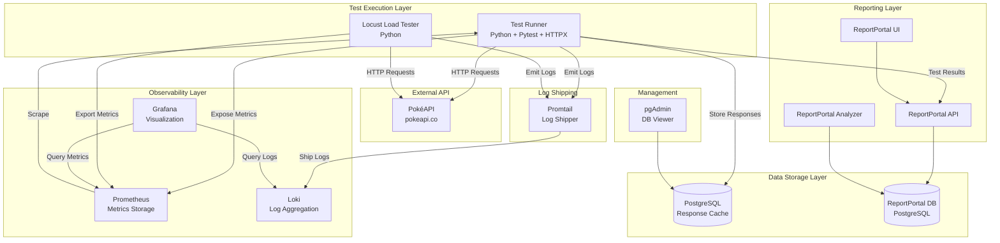

# Design Document

## Overview

The **pokeapi-observability-tests** project is a production-grade QA automation infrastructure that validates the PokéAPI through functional testing, load testing, and comprehensive observability. The system is built on a microservices architecture using Docker Compose, with each component serving a specific purpose in the testing and monitoring pipeline.

The design emphasizes:
- **Separation of concerns**: Testing, metrics, logging, and reporting are independent services
- **Scalability**: Load tests can simulate varying user loads; metrics scale with test volume
- **Observability**: Full visibility into test execution through metrics, logs, and dashboards
- **Data persistence**: Historical comparison enables regression detection beyond functional correctness
- **CI/CD integration**: Automated execution on every commit with manual trigger support

## Architecture

### High-Level Architecture



### Component Responsibilities

**Test Runner (Python + Pytest + HTTPX)**
- Execute functional API tests against PokéAPI using HTTPX
- Validate responses using Pydantic models
- Store responses in PostgreSQL for historical comparison
- Expose custom Prometheus metrics
- Send test results to ReportPortal
- Emit structured logs for Promtail collection

**Locust Load Tester**
- Execute performance and load tests using Python
- Measure response times and throughput
- Export metrics to Prometheus via locust-exporter
- Provide web UI for real-time monitoring
- Generate load test summary reports
- Reuse Pydantic models and API client code from pytest tests

**PostgreSQL (Response Cache)**
- Store complete API responses with timestamps
- Store schema versions for change tracking
- Enable historical data comparison queries

**ReportPortal**
- Aggregate test results across runs
- Provide test execution history and trends
- Auto-analyze failure patterns
- Store test artifacts (logs, response payloads)

**Prometheus**
- Scrape and store custom metrics from Test Runner
- Ingest Locust load test metrics via locust-exporter
- Provide query interface for Grafana

**Loki**
- Aggregate structured logs from test executions
- Enable log searching and filtering
- Integrate with Grafana for log visualization

**Promtail**
- Collect logs from Test Runner container
- Add metadata labels (container, service)
- Ship logs to Loki

**Grafana**
- Visualize metrics from Prometheus
- Display logs from Loki
- Provide pre-configured dashboards for test metrics and API health

**pgAdmin**
- Provide web UI for PostgreSQL database inspection
- Enable manual query execution for debugging

## Components and Interfaces

### Test Runner Component

**Technology Stack:**

*Core Dependencies:*
- Python 3.11+
- pytest 7.x
- httpx 0.25+ (async HTTP client)
- pydantic 2.x
- pytest-reportportal (test reporting)
- prometheus-client (metrics exposure)
- psycopg2 (PostgreSQL driver)
- python-json-logger (structured logging)
- tenacity 8.x (retry logic with exponential backoff)
- python-dotenv (environment variable management)

*Essential Pytest Plugins:*
- pytest-asyncio (async test support for HTTPX)
- pytest-xdist (parallel test execution)
- pytest-cov (code coverage reporting)
- pytest-html (HTML test reports)
- pytest-env (environment variable management)
- pytest-timeout (prevent hanging tests)
- pytest-rerunfailures (retry flaky tests - now required)

*Optional Pytest Plugins:*
- pytest-mock (mocking utilities)
- pytest-order (control test execution order)
- pytest-faker (generate test data)
- pytest-loguru (enhanced logging)

*Security & Quality Tools:*
- truffleHog or git-secrets (secrets scanning)
- ruff (linting)
- black (code formatting)
- mypy (type checking)

**Module Structure:**
```
tests/
├── conftest.py                 # Pytest fixtures and configuration
├── api/
│   ├── __init__.py
│   ├── client.py              # HTTPX-based API client wrapper
│   └── endpoints.py           # Endpoint URL constants
├── models/
│   ├── __init__.py
│   ├── pokemon.py             # Pydantic model for pokemon endpoint
│   ├── type.py                # Pydantic model for type endpoint
│   └── ability.py             # Pydantic model for ability endpoint
├── utils/
│   ├── __init__.py
│   ├── metrics.py             # Prometheus metrics definitions
│   ├── database.py            # PostgreSQL connection and queries
│   ├── schema_tracker.py      # Schema comparison logic
│   └── logger.py              # Structured logging configuration
├── smoke/
│   ├── __init__.py
│   └── test_basic_endpoints.py
├── regression/
│   ├── __init__.py
│   ├── test_pagination.py
│   └── test_error_handling.py
└── load/
    ├── __init__.py
    └── test_concurrent_requests.py
```

**Key Interfaces:**

```python
# api/client.py
class PokeAPIClient:
    def __init__(self, base_url: str, metrics: MetricsCollector, timeout: float = 10.0, rate_limiter: RateLimiter = None)
    async def get_pokemon(self, pokemon_id: int) -> dict
    async def get_type(self, type_id: int) -> dict
    async def get_ability(self, ability_id: int) -> dict
    def close(self) -> None  # Close HTTPX client
    
# utils/rate_limiter.py
class RateLimiter:
    def __init__(self, max_requests: int, time_window: float)
    async def acquire(self) -> None  # Wait if rate limit exceeded
    def reset(self) -> None
    
# utils/circuit_breaker.py
class CircuitBreaker:
    def __init__(self, failure_threshold: float, timeout: float)
    async def call(self, func: Callable) -> Any
    def is_open(self) -> bool
    def record_success(self) -> None
    def record_failure(self) -> None
    
# utils/metrics.py
class MetricsCollector:
    def increment_request_counter(self, endpoint: str)
    def record_latency(self, endpoint: str, duration_seconds: float)
    def increment_failure_counter(self, endpoint: str, failure_type: str)
    def increment_schema_change_counter(self, endpoint: str)
    
# utils/database.py
class ResponseRepository:
    def store_response(self, endpoint: str, resource_id: int, response_data: dict)
    def get_latest_response(self, endpoint: str, resource_id: int) -> dict | None
    def store_schema_version(self, endpoint: str, schema_structure: dict)
    def get_latest_schema(self, endpoint: str) -> dict | None
    
# utils/schema_tracker.py
class SchemaTracker:
    def compare_schemas(self, current: dict, previous: dict) -> SchemaDiff
    def extract_schema_structure(self, response: dict) -> dict
```

### Locust Load Test Component

**Technology Stack:**
- Locust 2.x
- Python 3.11+
- locust-exporter (for Prometheus integration)
- Can reuse existing Pydantic models and API client

**Script Structure:**
```
locust/
├── locustfile.py              # Main locust configuration
├── tasks/
│   ├── __init__.py
│   ├── pokemon_tasks.py       # Pokemon endpoint load tasks
│   ├── type_tasks.py          # Type endpoint load tasks
│   └── ability_tasks.py       # Ability endpoint load tasks
├── config/
│   └── load_profiles.py       # Load test configurations
└── utils/
    └── shared_client.py       # Shared API client (reuses test code)
```

**Load Test Configuration:**
```python
from locust import HttpUser, task, between

class PokeAPIUser(HttpUser):
    wait_time = between(1, 3)  # Wait 1-3 seconds between tasks
    host = "https://pokeapi.co/api/v2"
    
    @task(3)  # Weight: 3x more likely than other tasks
    def get_pokemon(self):
        pokemon_id = random.randint(1, 151)
        self.client.get(f"/pokemon/{pokemon_id}")
    
    @task(1)
    def get_type(self):
        type_id = random.randint(1, 18)
        self.client.get(f"/type/{type_id}")
```

**Load Test Stages (CLI):**
```bash
# Ramp-up: Start with 10 users, ramp to 50 over 30s, sustain for 1m
locust -f locustfile.py --headless \
  --users 50 --spawn-rate 1.33 \
  --run-time 2m \
  --host https://pokeapi.co/api/v2
```

### Docker Compose Services

**Service Definitions:**

```yaml
services:
  test-runner:
    - Exposes port 8000 for Prometheus metrics
    - Mounts test code as volume
    - Connects to postgres, reportportal, prometheus
    - Uses HTTPX for HTTP requests (no browser dependencies)
    
  locust:
    - Exposes port 8089 for web UI
    - Mounts locust scripts as volume
    - Can reuse test code from test-runner
    
  locust-exporter:
    - Exposes port 9646 for Prometheus scraping
    - Connects to locust for metrics collection
    
  postgres:
    - Exposes port 5432
    - Persistent volume for data
    - Initialized with schema for response cache
    
  reportportal-ui:
    - Exposes port 8080
    - Connects to reportportal-api
    
  reportportal-api:
    - Connects to reportportal-postgres
    
  reportportal-analyzer:
    - Connects to reportportal-postgres
    
  reportportal-postgres:
    - Persistent volume for ReportPortal data
    
  prometheus:
    - Exposes port 9090
    - Mounts prometheus.yml configuration
    - Scrapes test-runner:8000/metrics
    - Scrapes locust-exporter:9646/metrics
    
  grafana:
    - Exposes port 3000
    - Mounts provisioned dashboards and datasources
    - Connects to prometheus and loki
    
  loki:
    - Exposes port 3100
    - Persistent volume for logs
    
  promtail:
    - Mounts docker.sock for container log access
    - Configured to ship test-runner logs to loki
    
  pgadmin:
    - Exposes port 5050
    - Pre-configured with postgres connection
```

## Data Models

### Pydantic Models for API Validation

**Pokemon Model:**
```python
from pydantic import BaseModel, Field
from typing import List, Optional

class PokemonType(BaseModel):
    slot: int
    type: TypeReference

class TypeReference(BaseModel):
    name: str
    url: str

class PokemonAbility(BaseModel):
    is_hidden: bool
    slot: int
    ability: AbilityReference

class AbilityReference(BaseModel):
    name: str
    url: str

class PokemonStat(BaseModel):
    base_stat: int
    effort: int
    stat: StatReference

class StatReference(BaseModel):
    name: str
    url: str

class PokemonSprite(BaseModel):
    front_default: Optional[str] = None
    back_default: Optional[str] = None
    # Additional sprite fields as needed

class Pokemon(BaseModel):
    id: int
    name: str
    base_experience: Optional[int] = None
    height: int
    weight: int
    types: List[PokemonType]
    abilities: List[PokemonAbility]
    stats: List[PokemonStat]
    sprites: PokemonSprite
    
    class Config:
        extra = "allow"  # Allow additional fields from API
```

**Type Model:**
```python
class TypePokemon(BaseModel):
    slot: int
    pokemon: PokemonReference

class PokemonReference(BaseModel):
    name: str
    url: str

class Type(BaseModel):
    id: int
    name: str
    damage_relations: dict
    pokemon: List[TypePokemon]
    moves: List[dict]
    
    class Config:
        extra = "allow"
```

**Ability Model:**
```python
class EffectEntry(BaseModel):
    effect: str
    language: LanguageReference
    short_effect: str

class LanguageReference(BaseModel):
    name: str
    url: str

class Ability(BaseModel):
    id: int
    name: str
    is_main_series: bool
    effect_entries: List[EffectEntry]
    pokemon: List[dict]
    
    class Config:
        extra = "allow"
```

### PostgreSQL Schema

**api_responses table:**
```sql
CREATE TABLE api_responses (
    id SERIAL PRIMARY KEY,
    endpoint VARCHAR(100) NOT NULL,
    resource_id INTEGER NOT NULL,
    response_data JSONB NOT NULL,
    created_at TIMESTAMP DEFAULT CURRENT_TIMESTAMP,
    UNIQUE(endpoint, resource_id, created_at)
);

CREATE INDEX idx_endpoint_resource ON api_responses(endpoint, resource_id);
CREATE INDEX idx_created_at ON api_responses(created_at DESC);
```

**schema_versions table:**
```sql
CREATE TABLE schema_versions (
    id SERIAL PRIMARY KEY,
    endpoint VARCHAR(100) NOT NULL,
    schema_structure JSONB NOT NULL,
    created_at TIMESTAMP DEFAULT CURRENT_TIMESTAMP
);

CREATE INDEX idx_schema_endpoint ON schema_versions(endpoint, created_at DESC);
```

**schema_changes table:**
```sql
CREATE TABLE schema_changes (
    id SERIAL PRIMARY KEY,
    endpoint VARCHAR(100) NOT NULL,
    change_type VARCHAR(50) NOT NULL,  -- 'field_added', 'field_removed', 'type_changed'
    field_path VARCHAR(255) NOT NULL,
    old_value TEXT,
    new_value TEXT,
    detected_at TIMESTAMP DEFAULT CURRENT_TIMESTAMP
);

CREATE INDEX idx_changes_endpoint ON schema_changes(endpoint, detected_at DESC);
```

### Prometheus Metrics Schema

**Custom Metrics:**
```python
# Counter metrics
pokeapi_requests_total = Counter(
    'pokeapi_requests_total',
    'Total number of requests to PokéAPI',
    ['endpoint']
)

pokeapi_failures_total = Counter(
    'pokeapi_failures_total',
    'Total number of failed requests',
    ['endpoint', 'failure_type']
)

pokeapi_schema_changes_total = Counter(
    'pokeapi_schema_changes_total',
    'Total number of schema changes detected',
    ['endpoint']
)

# Histogram metrics
pokeapi_request_duration_seconds = Histogram(
    'pokeapi_request_duration_seconds',
    'Request duration in seconds',
    ['endpoint'],
    buckets=[0.1, 0.25, 0.5, 1.0, 2.5, 5.0, 10.0]
)

# Gauge metrics
pokeapi_test_execution_timestamp = Gauge(
    'pokeapi_test_execution_timestamp',
    'Timestamp of last test execution',
    ['suite']
)
```

### Grafana Dashboard Definitions

**Dashboard 1: API Performance**
- Panel: Response latency by endpoint (line graph)
- Panel: Request rate by endpoint (bar chart)
- Panel: Error rate percentage (gauge)
- Panel: P95 latency by endpoint (stat)

**Dashboard 2: Test Execution**
- Panel: Test pass/fail rate (pie chart)
- Panel: Tests executed over time (line graph)
- Panel: Failure types distribution (bar chart)
- Panel: Schema changes timeline (table)

**Dashboard 3: Locust Load Tests**
- Panel: Virtual users over time (area graph)
- Panel: Request duration percentiles (line graph)
- Panel: Requests per second (line graph)
- Panel: Failed requests (stat)
- Panel: Response time distribution (histogram)

## Correctness Properties

*A property is a characteristic or behavior that should hold true across all valid executions of a system—essentially, a formal statement about what the system should do. Properties serve as the bridge between human-readable specifications and machine-verifiable correctness guarantees.*


### Property Reflection

Before defining correctness properties, let's identify and eliminate redundancy:

**Schema Validation Properties (3.1-3.5):**
- Properties 3.1, 3.2, 3.3 all test that Pydantic models enforce required fields for different endpoints
- These can be combined into one comprehensive property: "For any endpoint response, Pydantic models enforce required fields"
- Properties 3.4 and 3.5 test opposite behaviors (allow extra vs reject missing) - both are unique and valuable

**Response Storage Properties (5.1-5.3):**
- All three test the same behavior for different endpoints
- Can be combined into: "For any API response, store complete JSON in database"

**Pytest Mark Properties (12.1-12.6):**
- Properties 12.1-12.3 test mark inclusion (redundant with 12.4-12.6)
- Properties 12.4-12.6 test mark filtering which subsumes the inclusion behavior
- Keep only 12.4-12.6

**Metrics Properties (7.1-7.5):**
- All are unique - each tests a different metric type
- No redundancy

**After reflection, we'll consolidate redundant properties while preserving unique validation value.**

### Correctness Properties

Property 1: Pydantic schema validation enforces required fields
*For any* PokéAPI endpoint response (pokemon, type, ability), when validated against its Pydantic model, all required fields (id, name, and endpoint-specific fields) must be present or validation fails with specific field errors
**Validates: Requirements 3.1, 3.2, 3.3, 3.5**

Property 2: Pydantic models allow extra fields
*For any* API response containing fields beyond the Pydantic model definition, validation shall pass without errors
**Validates: Requirements 3.4**

Property 3: API responses are stored in database
*For any* successful API response from pokemon, type, or ability endpoints, the complete JSON response shall be stored in PostgreSQL with endpoint name, resource ID, and timestamp
**Validates: Requirements 5.1, 5.2, 5.3**

Property 4: Schema comparison detects changes
*For any* API response, when compared against the previously stored schema structure, any added, removed, or modified fields shall be identified and logged
**Validates: Requirements 4.1, 4.2**

Property 5: Schema changes are persisted
*For any* detected schema change, the new schema version shall be stored in PostgreSQL with a timestamp
**Validates: Requirements 4.3**

Property 6: Schema changes trigger warnings
*For any* detected schema change, a warning shall be reported in ReportPortal with change details
**Validates: Requirements 4.4**

Property 7: Unchanged schemas skip extra logging
*For any* API response with no schema changes, no additional schema-related warnings shall be logged
**Validates: Requirements 4.5**

Property 8: Data differences are identified
*For any* current API response compared against historical data for the same resource, all fields with changed values shall be identified
**Validates: Requirements 5.4**

Property 9: Data differences are logged
*For any* detected data difference, the specific field paths and old versus new values shall be logged
**Validates: Requirements 5.5**

Property 10: Data differences are reported
*For any* detected data difference, comparison results with diff details shall be reported in ReportPortal
**Validates: Requirements 5.6**

Property 11: Request metrics are incremented
*For any* API request executed by a test, the prometheus counter metric for total requests shall increment for that endpoint
**Validates: Requirements 7.1**

Property 12: Latency metrics are recorded
*For any* API response received, the prometheus histogram metric for response latency shall record the duration for that endpoint
**Validates: Requirements 7.2**

Property 13: Failure metrics are incremented
*For any* test failure, the prometheus counter metric for failures shall increment with the endpoint and failure type labels
**Validates: Requirements 7.3**

Property 14: Schema change metrics are incremented
*For any* detected schema change, the prometheus counter metric for schema changes shall increment for that endpoint
**Validates: Requirements 7.4**

Property 15: All metrics are exposed
*For any* Prometheus scrape request, all custom metrics (counters, histograms, gauges) shall be exposed on the configured metrics endpoint
**Validates: Requirements 7.5**

Property 16: Structured logs contain required fields
*For any* test execution, emitted logs shall contain timestamp, log level, test name, and message fields
**Validates: Requirements 9.1**

Property 17: API request logs contain details
*For any* API request made during testing, logs shall contain request method, endpoint, and response status code
**Validates: Requirements 9.2**

Property 18: Failure logs contain details
*For any* test failure, logs shall contain failure reason, stack trace, and assertion details
**Validates: Requirements 9.3**

Property 19: Logs are shipped with metadata
*For any* log collected by Promtail, it shall be shipped to Loki with container labels and metadata
**Validates: Requirements 9.4**

Property 20: Logs are filterable
*For any* log query in Grafana/Loki, results shall be filterable by test name, endpoint, and log level
**Validates: Requirements 9.5**

Property 21: Test results are sent to ReportPortal
*For any* test execution, test start time, finish time, status, and logs shall be reported to ReportPortal
**Validates: Requirements 2.3, 10.2**

Property 22: ReportPortal launches have metadata
*For any* test suite execution, a ReportPortal launch shall be created with launch name, description, and tags
**Validates: Requirements 10.1**

Property 23: ReportPortal launches are tagged by suite
*For any* test marked with pytest marks (smoke, regression, load), the ReportPortal launch shall include the corresponding suite type tag
**Validates: Requirements 10.3**

Property 24: Attachments are uploaded to ReportPortal
*For any* test that includes attachments (response payloads, screenshots), they shall be uploaded to ReportPortal
**Validates: Requirements 10.5**

Property 25: Pytest marks filter test execution
*For any* pytest invocation with -m flag (smoke, regression, load), only tests marked with that marker shall execute
**Validates: Requirements 2.4, 12.4, 12.5, 12.6**

Property 26: Locust generates statistics
*For any* Locust load test execution, response time statistics including percentiles shall be calculated and reported
**Validates: Requirements 6.2**

Property 27: Locust exports metrics
*For any* Locust load test execution, metrics shall be exported to Prometheus via locust-exporter
**Validates: Requirements 6.3**

Property 28: Locust generates summary reports
*For any* completed Locust load test, a summary report containing total requests, failures, and latency percentiles shall be generated
**Validates: Requirements 6.4**

Property 29: CI/CD executes tests and publishes results
*For any* CI/CD workflow run, pytest tests shall execute and results shall be published to ReportPortal
**Validates: Requirements 11.3**

Property 30: CI/CD executes load tests
*For any* CI/CD workflow run, Locust load tests shall execute and export metrics
**Validates: Requirements 11.4**

Property 31: CI/CD uploads artifacts
*For any* CI/CD workflow run, test artifacts including logs and reports shall be uploaded
**Validates: Requirements 11.5**

Property 32: Invalid resource IDs return errors
*For any* invalid resource ID (negative, zero, extremely large), the API shall return appropriate error responses (404 or similar)
**Validates: Requirements 13.5**

## Error Handling

### API Client Error Handling

**Network Errors:**
- HTTPX timeout errors (default 10s timeout)
- Connection errors (DNS resolution, connection refused)
- SSL/TLS errors
- Strategy: Retry with exponential backoff (max 3 retries), log error details, fail test with clear message

**HTTP Error Responses:**
- 4xx client errors (400, 404, 429 rate limiting)
- 5xx server errors (500, 503)
- Strategy: No retry for 4xx (except 429), log response body, assert expected status codes in tests

**Rate Limiting (429 Responses):**
- Respect `Retry-After` header from API
- If no header, use exponential backoff: 1s, 2s, 4s, 8s
- Add jitter (random 0-1s) to prevent thundering herd
- Max 5 retries for rate limit errors
- Log rate limit events to Prometheus counter

**Circuit Breaker Pattern:**
- Track failure rate per endpoint (5-minute window)
- Open circuit after 50% failure rate over 10 requests
- Half-open after 30 seconds to test recovery
- Close circuit after 3 consecutive successes
- Log circuit state changes to Prometheus gauge

**Response Parsing Errors:**
- Invalid JSON responses
- Malformed response bodies
- Strategy: Log raw response, fail test with parsing error details

### Pydantic Validation Error Handling

**Schema Validation Failures:**
- Missing required fields
- Type mismatches (string vs int)
- Invalid enum values
- Strategy: Capture ValidationError, extract field-level errors, report to ReportPortal with full details

**Extra Fields:**
- Configured to allow extra fields (Config.extra = "allow")
- Log warning for unexpected fields but don't fail validation
- Track new fields in schema change detection

### Database Error Handling

**Connection Errors:**
- PostgreSQL connection failures
- Connection pool exhaustion
- Strategy: Retry connection with backoff, fail gracefully if database unavailable, continue tests but skip historical comparison

**Query Errors:**
- Constraint violations
- Serialization errors
- Strategy: Log error with query details, rollback transaction, continue test execution

**Data Integrity:**
- Duplicate key violations (handled by UNIQUE constraints)
- Strategy: Update existing record instead of insert (UPSERT pattern)

### Prometheus Metrics Error Handling

**Metrics Export Failures:**
- Prometheus scrape failures
- Metric registration conflicts
- Strategy: Log warning, continue test execution (metrics are observability, not critical path)

**Invalid Metric Values:**
- Negative durations
- Invalid label values
- Strategy: Validate before recording, use default/zero value if invalid, log warning

### ReportPortal Integration Error Handling

**Connection Failures:**
- ReportPortal API unavailable
- Authentication failures
- Strategy: Retry with backoff, queue results locally, continue test execution even if reporting fails

**Launch Creation Failures:**
- Duplicate launch names
- Invalid launch configuration
- Strategy: Generate unique launch name with timestamp, log error, continue tests

### Locust Error Handling

**Load Test Failures:**
- Target host unreachable
- Request timeouts during load test
- Strategy: Record failures in Locust stats, continue load test, report failure rate in summary

**Metrics Export Failures:**
- locust-exporter unavailable
- Strategy: Log warning, continue load test (metrics are observability)

### Logging Error Handling

**Loki/Promtail Failures:**
- Loki unavailable
- Log shipping failures
- Strategy: Buffer logs locally, retry shipping, continue test execution (logs are observability)

**Structured Logging Errors:**
- JSON serialization failures
- Invalid log format
- Strategy: Fall back to plain text logging, log error, continue execution

## Secrets Management

### Environment Variables

**Local Development:**
```bash
# .env file (never committed)
POKEAPI_BASE_URL=https://pokeapi.co/api/v2
REPORTPORTAL_ENDPOINT=http://localhost:8080
REPORTPORTAL_PROJECT=pokeapi-tests
REPORTPORTAL_API_TOKEN=your_token_here
POSTGRES_PASSWORD=your_password_here
GRAFANA_ADMIN_PASSWORD=admin
```

**CI/CD (GitHub Secrets):**
- `REPORTPORTAL_API_TOKEN`
- `POSTGRES_PASSWORD`
- `GRAFANA_ADMIN_PASSWORD`

**Secrets Masking:**
```python
# utils/logger.py
SENSITIVE_KEYS = ['token', 'password', 'secret', 'api_key']

def mask_sensitive_data(data: dict) -> dict:
    """Recursively mask sensitive values in logs"""
    for key, value in data.items():
        if any(sensitive in key.lower() for sensitive in SENSITIVE_KEYS):
            data[key] = '***MASKED***'
    return data
```

**Secrets Scanning:**
- Pre-commit hook with truffleHog
- CI job to scan for leaked credentials
- Fail build if secrets detected

## Alerting and SLOs

### Prometheus Alerting Rules

**alerting_rules.yml:**
```yaml
groups:
  - name: pokeapi_tests
    interval: 30s
    rules:
      - alert: HighAPILatency
        expr: histogram_quantile(0.95, pokeapi_request_duration_seconds) > 0.5
        for: 5m
        labels:
          severity: warning
        annotations:
          summary: "High API latency detected"
          description: "P95 latency is {{ $value }}s for endpoint {{ $labels.endpoint }}"
      
      - alert: HighTestFailureRate
        expr: rate(pokeapi_failures_total[10m]) / rate(pokeapi_requests_total[10m]) > 0.1
        for: 10m
        labels:
          severity: critical
        annotations:
          summary: "High test failure rate"
          description: "Failure rate is {{ $value | humanizePercentage }} for endpoint {{ $labels.endpoint }}"
      
      - alert: SchemaChangeDetected
        expr: increase(pokeapi_schema_changes_total[1h]) > 0
        labels:
          severity: info
        annotations:
          summary: "API schema change detected"
          description: "Schema changed for endpoint {{ $labels.endpoint }}"
      
      - alert: CircuitBreakerOpen
        expr: pokeapi_circuit_breaker_state == 1
        for: 2m
        labels:
          severity: warning
        annotations:
          summary: "Circuit breaker opened"
          description: "Circuit breaker is open for endpoint {{ $labels.endpoint }}"
```

### Grafana Alerting

**Alert Channels:**
- Email notifications
- Slack webhook (optional)
- PagerDuty integration (optional)

**Alert Configuration:**
- Link alerts to Prometheus alert rules
- Configure notification policies
- Set up alert silencing for maintenance windows

## Performance Baseline Tracking

### Baseline Storage Schema

**performance_baselines table:**
```sql
CREATE TABLE performance_baselines (
    id SERIAL PRIMARY KEY,
    endpoint VARCHAR(100) NOT NULL,
    metric_name VARCHAR(50) NOT NULL,  -- 'p50', 'p95', 'p99'
    baseline_value FLOAT NOT NULL,
    sample_size INTEGER NOT NULL,
    calculated_at TIMESTAMP DEFAULT CURRENT_TIMESTAMP,
    valid_from TIMESTAMP DEFAULT CURRENT_TIMESTAMP,
    valid_until TIMESTAMP,
    UNIQUE(endpoint, metric_name, valid_from)
);

CREATE INDEX idx_baselines_endpoint ON performance_baselines(endpoint, valid_from DESC);
```

**Baseline Calculation:**
- Calculate baselines weekly from last 7 days of data
- Store P50, P95, P99 for each endpoint
- Compare current test run against active baseline
- Alert if deviation > 20% from baseline

### Regression Detection

```python
# utils/performance_tracker.py
class PerformanceTracker:
    def __init__(self, db: ResponseRepository)
    
    def calculate_baseline(self, endpoint: str, days: int = 7) -> dict:
        """Calculate P50, P95, P99 from historical data"""
        
    def check_regression(self, endpoint: str, current_latency: float) -> bool:
        """Compare current latency against baseline"""
        
    def store_baseline(self, endpoint: str, metrics: dict) -> None:
        """Store new baseline version"""
```

## Test Flakiness Detection

### Flakiness Tracking

**flaky_tests table:**
```sql
CREATE TABLE flaky_tests (
    id SERIAL PRIMARY KEY,
    test_name VARCHAR(255) NOT NULL,
    total_runs INTEGER DEFAULT 0,
    flaky_runs INTEGER DEFAULT 0,
    last_flaky_at TIMESTAMP,
    created_at TIMESTAMP DEFAULT CURRENT_TIMESTAMP,
    UNIQUE(test_name)
);

CREATE INDEX idx_flaky_tests_name ON flaky_tests(test_name);
```

**Flakiness Metrics:**
```python
# Prometheus metrics
pokeapi_test_flakiness_total = Counter(
    'pokeapi_test_flakiness_total',
    'Total number of flaky test occurrences',
    ['test_name']
)

pokeapi_test_flakiness_rate = Gauge(
    'pokeapi_test_flakiness_rate',
    'Flakiness rate per test (flaky_runs / total_runs)',
    ['test_name']
)
```

**pytest Configuration:**
```ini
[pytest]
# Retry failed tests up to 3 times
addopts = --reruns 3 --reruns-delay 1
```

## ReportPortal Setup Guide

### Docker Compose Configuration

ReportPortal services already included in docker-compose.yml:
- reportportal-ui (port 8080)
- reportportal-api
- reportportal-analyzer
- reportportal-postgres

### Initial Setup Steps

1. **Start ReportPortal:**
```bash
docker-compose up -d reportportal-ui reportportal-api reportportal-analyzer reportportal-postgres
```

2. **Access UI:**
- URL: http://localhost:8080
- Default credentials: `superadmin` / `erebus`

3. **Create Project:**
- Login → Projects → Add Project
- Project name: `pokeapi-tests`
- Project type: `INTERNAL`

4. **Generate API Token:**
- User Profile → API Keys → Generate
- Copy token to `.env` file

5. **Configure Auto-Analysis:**
- Project Settings → Auto-Analysis
- Enable "Auto-Analysis" toggle
- Set minimum should match: 95%
- Enable "Unique Error Auto-Analysis"

6. **Configure Integrations (Optional):**
- Project Settings → Integrations
- Add Jira, Slack, or email integrations

### pytest-reportportal Configuration

**pytest.ini:**
```ini
[pytest]
rp_endpoint = http://localhost:8080
rp_project = pokeapi-tests
rp_launch = PokéAPI Tests
rp_launch_description = Automated API tests for PokéAPI
rp_launch_attributes = suite:smoke env:local
rp_log_batch_size = 20
```

## Docker Optimization

### .dockerignore

```
# Python
__pycache__/
*.py[cod]
*$py.class
*.so
.Python
env/
venv/
.venv/

# Testing
.pytest_cache/
.coverage
htmlcov/
.tox/

# IDE
.vscode/
.idea/
*.swp
*.swo

# Git
.git/
.gitignore

# Documentation
*.md
docs/

# CI/CD
.github/

# Logs
*.log
```

### Health Checks

**docker-compose.yml additions:**
```yaml
services:
  test-runner:
    healthcheck:
      test: ["CMD", "curl", "-f", "http://localhost:8000/health"]
      interval: 30s
      timeout: 10s
      retries: 3
      start_period: 40s
  
  postgres:
    healthcheck:
      test: ["CMD-SHELL", "pg_isready -U postgres"]
      interval: 10s
      timeout: 5s
      retries: 5
  
  prometheus:
    healthcheck:
      test: ["CMD", "wget", "--quiet", "--tries=1", "--spider", "http://localhost:9090/-/healthy"]
      interval: 30s
      timeout: 10s
      retries: 3
```

### Multi-Stage Dockerfile

**Dockerfile for test-runner:**
```dockerfile
# Build stage
FROM python:3.11-slim as builder
WORKDIR /app
COPY requirements.txt .
RUN pip install --user --no-cache-dir -r requirements.txt

# Runtime stage
FROM python:3.11-slim
WORKDIR /app
COPY --from=builder /root/.local /root/.local
COPY . .
ENV PATH=/root/.local/bin:$PATH
EXPOSE 8000
CMD ["python", "-m", "pytest"]
```

## Testing Strategy

### Dual Testing Approach

The project employs both unit testing and property-based testing to ensure comprehensive coverage:

**Unit Tests:**
- Verify specific examples and edge cases
- Test integration points between components
- Validate infrastructure setup (Docker containers, database schema)
- Test specific API responses with known data

**Property-Based Tests:**
- Verify universal properties across all inputs
- Use Hypothesis library for Python property-based testing
- Generate random test data (pokemon IDs, response structures)
- Each property test runs minimum 100 iterations
- Each property-based test tagged with: `# Feature: pokeapi-observability-tests, Property {number}: {property_text}`

### Unit Testing Strategy

**API Client Tests:**
- Test successful requests to each endpoint
- Test timeout handling
- Test retry logic with exponential backoff
- Test error response handling (404, 500)
- Mock HTTPX responses for predictable testing

**Pydantic Model Tests:**
- Test valid response parsing for each model
- Test missing required fields raise ValidationError
- Test extra fields are allowed
- Test type coercion (string to int)
- Use example responses from PokéAPI documentation

**Database Tests:**
- Test response storage (insert and retrieve)
- Test schema version storage
- Test historical comparison queries
- Test UPSERT behavior for duplicate records
- Use pytest fixtures for database setup/teardown

**Metrics Tests:**
- Test counter increments
- Test histogram recordings
- Test metric exposure on /metrics endpoint
- Test label values are correct
- Mock Prometheus client for unit tests

**Schema Tracker Tests:**
- Test schema extraction from responses
- Test schema comparison (added/removed/modified fields)
- Test no changes detected for identical schemas
- Use example JSON structures

**Integration Tests:**
- Test end-to-end flow: API request → validation → storage → metrics → reporting
- Test Docker Compose stack startup
- Test Grafana dashboard accessibility
- Test ReportPortal launch creation

### Property-Based Testing Strategy

**Property Testing Library:**
- Hypothesis 6.x for Python
- Configure minimum 100 examples per property test
- Use `@given` decorator with custom strategies

**Test Data Generators:**
```python
from hypothesis import given, strategies as st

# Generate valid pokemon IDs (1-1000+)
pokemon_ids = st.integers(min_value=1, max_value=1000)

# Generate invalid pokemon IDs
invalid_ids = st.one_of(
    st.integers(max_value=0),
    st.integers(min_value=100000)
)

# Generate API response structures
pokemon_response = st.fixed_dictionaries({
    'id': st.integers(min_value=1),
    'name': st.text(min_size=1),
    'types': st.lists(st.fixed_dictionaries({...})),
    # ... other fields
})
```

**Property Test Implementation:**
- Each correctness property maps to one property-based test
- Tests tagged with property number and text
- Tests use realistic data generators
- Tests verify invariants hold across all generated inputs

**Example Property Test:**
```python
@given(pokemon_id=st.integers(min_value=1, max_value=151))
@pytest.mark.property
def test_property_3_responses_stored_in_database(pokemon_id):
    """
    Feature: pokeapi-observability-tests, Property 3: API responses are stored in database
    For any successful API response, complete JSON shall be stored in PostgreSQL
    """
    # Make API request
    response = client.get_pokemon(pokemon_id)
    
    # Verify stored in database
    stored = db.get_latest_response('pokemon', pokemon_id)
    assert stored is not None
    assert stored['response_data'] == response
```

### Test Organization

**Directory Structure:**
```
tests/
├── unit/
│   ├── test_api_client.py
│   ├── test_pydantic_models.py
│   ├── test_database.py
│   ├── test_metrics.py
│   └── test_schema_tracker.py
├── property/
│   ├── test_properties_validation.py      # Properties 1-2
│   ├── test_properties_storage.py         # Properties 3-10
│   ├── test_properties_metrics.py         # Properties 11-15
│   ├── test_properties_logging.py         # Properties 16-20
│   ├── test_properties_reporting.py       # Properties 21-24
│   └── test_properties_integration.py     # Properties 25-32
├── integration/
│   ├── test_docker_compose.py
│   ├── test_end_to_end.py
│   └── test_grafana_dashboards.py
├── smoke/
│   └── test_basic_endpoints.py
├── regression/
│   ├── test_pagination.py
│   └── test_error_handling.py
└── load/
    └── test_concurrent_requests.py
```

### Test Execution

**Local Development:**
```bash
# Run all tests
pytest

# Run specific suite
pytest -m smoke
pytest -m regression
pytest -m property

# Run with coverage
pytest --cov=tests --cov-report=html

# Run in parallel
pytest -n auto
```

**CI/CD Execution:**
- Smoke tests run on every commit (fast feedback)
- Regression tests run on every commit (comprehensive)
- Property tests run on every commit (100 examples each)
- Load tests run on schedule or manual trigger
- Coverage reports uploaded to CI artifacts

### Test Data Management

**Fixtures:**
- pytest fixtures for database connections
- pytest fixtures for HTTPX client setup
- pytest fixtures for mock responses
- pytest-faker for generating test data

**Test Isolation:**
- Each test uses separate database transaction (rollback after test)
- Metrics registry cleared between tests
- ReportPortal launches use unique names with timestamps

### Continuous Testing

**Pre-commit Hooks:**
- Run smoke tests before commit
- Run linting (ruff, black)
- Run type checking (mypy)

**CI Pipeline Stages:**
1. Lint and type check
2. Run unit tests
3. Run property tests
4. Run integration tests
5. Run smoke tests against live API
6. Generate coverage report
7. Publish results to ReportPortal
8. Upload artifacts

**Scheduled Tests:**
- Full regression suite: Daily at 2 AM UTC
- Load tests: Weekly on Sundays
- Schema change detection: Every 6 hours
